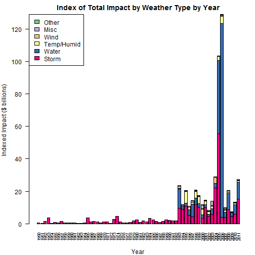

## Synopsis  
This document summarizes the economic and health impact of US weather events as captured in an NOAA database spanning 1950-2011.  Weather event tracking in this NOAA database significantly expanded in the mid-1990s and the analysis focuses on 15 years (1996-2010) with more complete data.  The raw dataset is known to be only a sample of the full NOAA Storm Data (e.g., it does not capture Louisiana fatalaties from Hurricane Katrina), and findings should be interpreted with that in mind.

* Economic impact (as reflected by property/crop damage) is primarily caused by hurricane winds, storm surges, and floods.  These three events collectively cause ~60% of property/crop damage.  

* Human health impact (as reflected by injuries/fatalities, with fatalities weighted more heavily) is heavily driven by extreme heat and tornadoes.  These two events combine to cause ~40% of injuries and fatalities.  

While there is occasional overlap among top causes, it appears different types of weather events tend to create large economic impacts vs. large health impacts.  
  
## Data Processing  
  
###_Initial Data Acquisition and Loading_  
Data for this project was obtained from [Storm Data Download](https://d396qusza40orc.cloudfront.net/repdata%2Fdata%2FStormData.csv.bz2).  The raw ZIP file is downloaded to the working directory, write-protected, and loaded using R.  The directions for this assignment asked that we start from the ZIP file after having downloaded it to our machine.


```r
## read.csv() directly reads .csv.bz2 files, managing decompression as part of the function
myCSV <- read.csv("repdata-data-StormData.csv.bz2", stringsAsFactors = FALSE, na.strings=c("NA",""))
str(myCSV)
```

```
## 'data.frame':	902297 obs. of  37 variables:
##  $ STATE__   : num  1 1 1 1 1 1 1 1 1 1 ...
##  $ BGN_DATE  : chr  "4/18/1950 0:00:00" "4/18/1950 0:00:00" "2/20/1951 0:00:00" "6/8/1951 0:00:00" ...
##  $ BGN_TIME  : chr  "0130" "0145" "1600" "0900" ...
##  $ TIME_ZONE : chr  "CST" "CST" "CST" "CST" ...
##  $ COUNTY    : num  97 3 57 89 43 77 9 123 125 57 ...
##  $ COUNTYNAME: chr  "MOBILE" "BALDWIN" "FAYETTE" "MADISON" ...
##  $ STATE     : chr  "AL" "AL" "AL" "AL" ...
##  $ EVTYPE    : chr  "TORNADO" "TORNADO" "TORNADO" "TORNADO" ...
##  $ BGN_RANGE : num  0 0 0 0 0 0 0 0 0 0 ...
##  $ BGN_AZI   : chr  NA NA NA NA ...
##  $ BGN_LOCATI: chr  NA NA NA NA ...
##  $ END_DATE  : chr  NA NA NA NA ...
##  $ END_TIME  : chr  NA NA NA NA ...
##  $ COUNTY_END: num  0 0 0 0 0 0 0 0 0 0 ...
##  $ COUNTYENDN: logi  NA NA NA NA NA NA ...
##  $ END_RANGE : num  0 0 0 0 0 0 0 0 0 0 ...
##  $ END_AZI   : chr  NA NA NA NA ...
##  $ END_LOCATI: chr  NA NA NA NA ...
##  $ LENGTH    : num  14 2 0.1 0 0 1.5 1.5 0 3.3 2.3 ...
##  $ WIDTH     : num  100 150 123 100 150 177 33 33 100 100 ...
##  $ F         : int  3 2 2 2 2 2 2 1 3 3 ...
##  $ MAG       : num  0 0 0 0 0 0 0 0 0 0 ...
##  $ FATALITIES: num  0 0 0 0 0 0 0 0 1 0 ...
##  $ INJURIES  : num  15 0 2 2 2 6 1 0 14 0 ...
##  $ PROPDMG   : num  25 2.5 25 2.5 2.5 2.5 2.5 2.5 25 25 ...
##  $ PROPDMGEXP: chr  "K" "K" "K" "K" ...
##  $ CROPDMG   : num  0 0 0 0 0 0 0 0 0 0 ...
##  $ CROPDMGEXP: chr  NA NA NA NA ...
##  $ WFO       : chr  NA NA NA NA ...
##  $ STATEOFFIC: chr  NA NA NA NA ...
##  $ ZONENAMES : chr  NA NA NA NA ...
##  $ LATITUDE  : num  3040 3042 3340 3458 3412 ...
##  $ LONGITUDE : num  8812 8755 8742 8626 8642 ...
##  $ LATITUDE_E: num  3051 0 0 0 0 ...
##  $ LONGITUDE_: num  8806 0 0 0 0 ...
##  $ REMARKS   : chr  NA NA NA NA ...
##  $ REFNUM    : num  1 2 3 4 5 6 7 8 9 10 ...
```

Inspection of the file shows 902,297 observations and 37 variables.  

###_Filtering to maintain only relevant columns_  
Some columns are not relevant for this analysis.  We are particularly interested in event date "BGN_DATE"; event type "EVTYPE"; health impacts "FATALITIES" and "INJURIES"; and economic impacts "PROPDMG" and "CROPDMG".  Note that economic impacts are reported such that order of magnitude (thousands, millions, or billions) is contained in separate columns "PROPDMGEXP" and "CROPDMGEXP".

We also keep the STATE and REFNUM columns in case there are useful for QC or follow-on analysis.


```r
myVars <- c("REFNUM","BGN_DATE","STATE","EVTYPE","FATALITIES","INJURIES",
            "PROPDMG","CROPDMG","PROPDMGEXP","CROPDMGEXP")
myFiltered <- myCSV[,myVars]
```

###_Calculating the event year/decade and checking the resulting data_  
We also create a year and decade variable for future analysis and inspect the file contents.


```r
myFiltered$year <- as.numeric(format(as.Date(myFiltered$BGN_DATE,format="%m/%d/%Y"),"%Y"))
myFiltered$decade <- 10 * (myFiltered$year %/% 10)
str(myFiltered)
```

```
## 'data.frame':	902297 obs. of  12 variables:
##  $ REFNUM    : num  1 2 3 4 5 6 7 8 9 10 ...
##  $ BGN_DATE  : chr  "4/18/1950 0:00:00" "4/18/1950 0:00:00" "2/20/1951 0:00:00" "6/8/1951 0:00:00" ...
##  $ STATE     : chr  "AL" "AL" "AL" "AL" ...
##  $ EVTYPE    : chr  "TORNADO" "TORNADO" "TORNADO" "TORNADO" ...
##  $ FATALITIES: num  0 0 0 0 0 0 0 0 1 0 ...
##  $ INJURIES  : num  15 0 2 2 2 6 1 0 14 0 ...
##  $ PROPDMG   : num  25 2.5 25 2.5 2.5 2.5 2.5 2.5 25 25 ...
##  $ CROPDMG   : num  0 0 0 0 0 0 0 0 0 0 ...
##  $ PROPDMGEXP: chr  "K" "K" "K" "K" ...
##  $ CROPDMGEXP: chr  NA NA NA NA ...
##  $ year      : num  1950 1950 1951 1951 1951 ...
##  $ decade    : num  1950 1950 1950 1950 1950 1950 1950 1950 1950 1950 ...
```

```r
summary(myFiltered[,c(5,6,7,8,11,12)])
```

```
##    FATALITIES          INJURIES            PROPDMG       
##  Min.   :  0.0000   Min.   :   0.0000   Min.   :   0.00  
##  1st Qu.:  0.0000   1st Qu.:   0.0000   1st Qu.:   0.00  
##  Median :  0.0000   Median :   0.0000   Median :   0.00  
##  Mean   :  0.0168   Mean   :   0.1557   Mean   :  12.06  
##  3rd Qu.:  0.0000   3rd Qu.:   0.0000   3rd Qu.:   0.50  
##  Max.   :583.0000   Max.   :1700.0000   Max.   :5000.00  
##     CROPDMG             year          decade    
##  Min.   :  0.000   Min.   :1950   Min.   :1950  
##  1st Qu.:  0.000   1st Qu.:1995   1st Qu.:1990  
##  Median :  0.000   Median :2002   Median :2000  
##  Mean   :  1.527   Mean   :1999   Mean   :1994  
##  3rd Qu.:  0.000   3rd Qu.:2007   3rd Qu.:2000  
##  Max.   :990.000   Max.   :2011   Max.   :2010
```

The summary statistics suggest a succesful conversion to numeric year/decade, with 50% of the records being from 1995-2007.  There are no NA records in the numeric fields that we plan to use.  We maintained all of the 902,297 observations along with the 10 key variables and 2 new derived variables (year and decade).

###_Calculating property/crop damage per event_  
##### **_Identify and plan around anomalous magnitudes for crop and property damage_**  
A contingency table is created to understand the entries in PROPDMGEXP and CROPDMGEXP:  

```r
table(myCSV$PROPDMGEXP,myCSV$CROPDMGEXP,useNA="always")
```

```
##       
##             ?      0      2      B      k      K      m      M   <NA>
##   -         0      0      0      0      0      0      0      0      1
##   ?         0      0      0      0      0      0      0      0      8
##   +         0      0      0      0      0      0      0      0      5
##   0         0      0      0      0      0      4      0      1    211
##   1         0      0      0      0      0      0      0      0     25
##   2         0      0      0      0      0      0      0      0     13
##   3         0      0      0      0      0      1      0      0      3
##   4         0      0      0      0      0      0      0      0      4
##   5         0      0      0      0      0      1      0      1     26
##   6         0      0      0      0      0      0      0      0      4
##   7         0      0      0      0      0      0      0      0      5
##   8         0      0      0      0      0      0      0      0      1
##   B         0      0      0      2      0     11      0     11     16
##   h         0      0      0      0      0      0      0      0      1
##   H         0      0      0      0      0      0      0      0      6
##   K         4     16      0      3     21 274690      0    864 149067
##   m         0      0      0      0      0      0      1      0      6
##   M         1      0      0      0      0   3260      0    674   7395
##   <NA>      2      3      1      4      0   3865      0    443 461616
```
  
Inspection of the PROPDMGEXP and CROPDMGEXP table, along with exploration of the associated records, suggests K/k is for thousands, M/m is for millions, and B is for billions (e.g., very large hurricanes and floods).

There are 321 records with PROPDMGEXP symbols that cannot be interpreted and 27 records with CROPDMGEXP symbols that cannot be interpreted.  Manual inspection of a sample of these records shows them to be unremarkable and they are all treated as having $0 of damage.  These anomalies occured primarily in 1995.

Further, there are 76 records where PROPDMGEXP is NA while PROPDMG > 0; and 3 records where CROPDMGEXP is NA while CROPDMG > 0.  Maunal inspection of a sample of these records shows them to be unremarkable, and they are all treated as having $0 of damage.  These anomalies all occur in 1993-1995.  

##### **_Convert property and crop damage to dollars based on k/K or m/M or B_**  
We convert all damage to millions of dollars for ease of future reporting.  If the PROPDMGEXP or CROPDMGEXP variable is not interpretable, it will stick with the default zero multiplier (treat as $0).  


```r
myFiltered$multProp <- 0
myFiltered$multProp[which(myFiltered$PROPDMGEXP %in% c("k","K"))] <- .001  ## thousands to millions
myFiltered$multProp[which(myFiltered$PROPDMGEXP %in% c("m","M"))] <- 1 ## leave millions as is
myFiltered$multProp[which(myFiltered$PROPDMGEXP %in% c("b","B"))] <- 1000 ## billions to millions

myFiltered$multCrop <- 0
myFiltered$multCrop[which(myFiltered$CROPDMGEXP %in% c("k","K"))] <- .001  ## thousands to millions
myFiltered$multCrop[which(myFiltered$CROPDMGEXP %in% c("m","M"))] <- 1 ## leave millions as is
myFiltered$multCrop[which(myFiltered$CROPDMGEXP %in% c("b","B"))] <- 1000 ## billions to millions

myFiltered$dollarProp <- myFiltered$PROPDMG * myFiltered$multProp ## field now in millions
myFiltered$dollarCrop <- myFiltered$CROPDMG * myFiltered$multCrop ## field now in millions

dim(myFiltered)
```

```
## [1] 902297     16
```

```r
colnames(myFiltered)
```

```
##  [1] "REFNUM"     "BGN_DATE"   "STATE"      "EVTYPE"     "FATALITIES"
##  [6] "INJURIES"   "PROPDMG"    "CROPDMG"    "PROPDMGEXP" "CROPDMGEXP"
## [11] "year"       "decade"     "multProp"   "multCrop"   "dollarProp"
## [16] "dollarCrop"
```

```r
set.seed(216160957)
myFiltered[sample(nrow(myFiltered),15,replace=FALSE),][c(1,8,10,13,15),]  ## Rows of more interest
```

```
##        REFNUM          BGN_DATE STATE      EVTYPE FATALITIES INJURIES
## 833635 833565 9/17/2010 0:00:00    NE        HAIL          0        0
## 802694 802624 5/23/2010 0:00:00    NV  DUST DEVIL          0        0
## 849334 849334 4/23/2011 0:00:00    MO        HAIL          0        0
## 893588 893539 8/28/2011 0:00:00    VT       FLOOD          0        0
## 530112 531181 5/23/2004 0:00:00    IL FLASH FLOOD          0        0
##        PROPDMG CROPDMG PROPDMGEXP CROPDMGEXP year decade multProp multCrop
## 833635       0       0          K          K 2010   2010    0.001    0.001
## 802694      50       0          K          K 2010   2010    0.001    0.001
## 849334      50       0          K          K 2011   2010    0.001    0.001
## 893588     500     500          M          K 2011   2010    1.000    0.001
## 530112       0       0       <NA>       <NA> 2004   2000    0.000    0.000
##        dollarProp dollarCrop
## 833635      0e+00        0.0
## 802694      5e-02        0.0
## 849334      5e-02        0.0
## 893588      5e+02        0.5
## 530112      0e+00        0.0
```

```r
myFiltered[myFiltered$multProp==1000,][sample(40,6,replace=FALSE),]
```

```
##        REFNUM          BGN_DATE STATE            EVTYPE FATALITIES
## 298088 298057 4/18/1997 0:00:00    ND             FLOOD          0
## 834674 834634 10/5/2010 0:00:00    AZ              HAIL          0
## 529498 529446 9/13/2004 0:00:00    FL HURRICANE/TYPHOON          7
## 860386 860355 4/27/2011 0:00:00    AL           TORNADO         44
## 529363 529311 8/13/2004 0:00:00    FL         HIGH WIND          4
## 366694 366653 9/15/1999 0:00:00    NC         HURRICANE          0
##        INJURIES PROPDMG CROPDMG PROPDMGEXP CROPDMGEXP year decade multProp
## 298088        0     3.0       0          B       <NA> 1997   1990     1000
## 834674        1     1.8       0          B          K 2010   2010     1000
## 529498        0     4.0      25          B          M 2004   2000     1000
## 860386      800     1.5       0          B          K 2011   2010     1000
## 529363        0     1.3       0          B       <NA> 2004   2000     1000
## 366694        0     3.0     500          B          M 1999   1990     1000
##        multCrop dollarProp dollarCrop
## 298088    0.000       3000          0
## 834674    0.001       1800          0
## 529498    1.000       4000         25
## 860386    0.001       1500          0
## 529363    0.000       1300          0
## 366694    1.000       3000        500
```

As expected, myFiltered still contains 902,297 observations.  There are 16 variables (original 10 key variables plus year/decade plus four new variables for use in the dollar value of damage as just described).  

The 2011 flood in Vermont correctly converts 500M to 500, while records with k/K correctly divide by 1000.  A sampling of records with billions of reported property damage reveals catastrophic event types commonly associated with reports of widespread property destruction.  Conversion to millions of dollars appears as intended in these samples.

Lastly, we examine the database totals for the key numeric variables (recall that conversions for dollarCrop and dollarProp made each of these represent millions of dollars).  


```r
colSums(myFiltered[,c(5:8,15:16)])
```

```
##  FATALITIES    INJURIES     PROPDMG     CROPDMG  dollarProp  dollarCrop 
##    15145.00   140528.00 10884500.01  1377827.32   427318.64    49104.19
```

Of note, the estimated $427 billion of property damage and $49 billion of crop damage over ~60 years is far more plausible than the unconverted $11 million of property damage and $1.4 million of crop damage.

###_Aggregating event types for further analysis_  
##### **_Declare an event type by finding key words in EVTYPE_**  

The EVTYPE variable is a bit messy, and we clean it with key word searches.  Exploratory analysis was run to understand key words associated with EVTYPES causing the strong majority of economic and health impacts.  The main implications of the approach arising from that exploratory analysis are included below as Addendum #1.  

A strategy to convert EVTYPE to eventType was developed, with the default being to declare eventType as "All Other" unless a specific keyword can be found.  The priority of the assignments is the reverse order of the variables declared in myShortEvent.  That is to say that if EVTYPE were "Thunderstorm with high wind due to tornado", then it would map to TORNADO and not to WIND or THUNDERSTORM.  The general intent was to prioritize more descriptive/severe event names over more general event names.


```r
myShortEvent <- c("WINTER","WIND","FREEZE","COLD","HEAT","RAIN","SNOW","ICE","HAIL","FLD","FLOOD",
                  "TSUNAMI","SURGE","DROUGHT","FOG","DUST","TSTM","THUNDERSTORM","LIGHTNING","FIRE",
                  "BLIZZARD","AVALANCHE","FLASH","SURF","RIP","TYPHOON","HURRICANE","TROPICAL","TORNADO"
                  )

myFiltered$eventType <- "All Other"

## This loop keeps overwriting eventType, so the last item from myShortEvent
## found within EVTYPE for a given record prevails; not a case sensitive search
for (myMatch in myShortEvent) {
    myFiltered$eventType[grep(myMatch,myFiltered$EVTYPE,ignore.case=TRUE)] <- myMatch
}
```

Further, a few event types were consolidated as they appear highly related to one another.


```r
myFiltered$eventType[myFiltered$eventType %in% c("HURRICANE","TYPHOON")] <- "TROPICAL"
myFiltered$eventType[myFiltered$eventType=="SURF"] <- "RIP"
myFiltered$eventType[myFiltered$eventType=="TSTM"] <- "THUNDERSTORM"
myFiltered$eventType[myFiltered$eventType %in% c("FLD")] <- "FLOOD"
myFiltered$eventType[myFiltered$eventType %in% c("TSUNAMI")] <- "FLASH"
myFiltered$eventType[myFiltered$eventType=="FREEZE"] <- "COLD"
myFiltered$eventType[myFiltered$EVTYPE %in% c("NON TSTM WIND","NON-TSTM WIND")] <- "WIND"
```

##### **_Declare an event class by further grouping eventType_**  
The event types were further aggregated to simplify some downstream reporting.


```r
myFiltered$masterType <- "Other"

myFiltered[myFiltered$eventType %in% c("HAIL","ICE","LIGHTNING","RAIN","SNOW",
                                       "THUNDERSTORM","TORNADO","TROPICAL","WINTER"),]$masterType <- "Storm"

myFiltered[myFiltered$eventType %in% c("COLD","DROUGHT","HEAT"),]$masterType <- "Temp/Dew Point"
myFiltered[myFiltered$eventType %in% c("BLIZZARD","WIND","DUST"),]$masterType <- "Wind"
myFiltered[myFiltered$eventType %in% c("FLASH","FLOOD","RIP","SURGE"),]$masterType <- "Water"
myFiltered[myFiltered$eventType %in% c("AVALANCHE","FIRE","FOG"),]$masterType <- "Assorted"
```

### Calculating a single number for economic impact, health impact, and total impact   
The focus of this analysis is to understand the impact of weather events on the economy and human health.  Additional variables are created to assess these overall impacts:  

* econImpact is the straight sum of crop damage and property damage, in millions of dollars
* healthImpact is an indexed aggregate of fatalities and injuries; the value of a human life lost is indexed as $5 million while the value of a human injury is indexed as $100,000; the sum of these indices is defined as healthImpact, in millions of dollars
* totalImpact is the straight sum of econImpact and healthImpact, in millions of dollars


```r
myFiltered$econImpact <- myFiltered$dollarProp + myFiltered$dollarCrop ## in millions
myFiltered$healthImpact <- 0.1 * myFiltered$INJURIES + 5 * myFiltered$FATALITIES ## indexed to millions
myFiltered$totalImpact <- myFiltered$econImpact + myFiltered$healthImpact ## indexed in millions

dim(myFiltered)
```

```
## [1] 902297     21
```

```r
colSums(myFiltered[,c(5:6,15:16,19:21)])
```

```
##   FATALITIES     INJURIES   dollarProp   dollarCrop   econImpact 
##     15145.00    140528.00    427318.64     49104.19    476422.83 
## healthImpact  totalImpact 
##     89777.80    566200.63
```

```r
print(paste0("Property damage represents ",round(100*sum(myFiltered[,15])/sum(myFiltered[,19]),0),
             "% of the $",round(sum(myFiltered[,19])/1000,0)," billion of indexed economic impact"
             )
      )
```

```
## [1] "Property damage represents 90% of the $476 billion of indexed economic impact"
```

```r
print(paste0("Fatalities represent ",round(100*5*sum(myFiltered[,5])/sum(myFiltered[,20]),0),
             "% of the $",round(sum(myFiltered[,20])/1000,0)," billion of indexed health impact"
             )
      )
```

```
## [1] "Fatalities represent 84% of the $90 billion of indexed health impact"
```

```r
print(paste0("Economic impact represents ",round(100*sum(myFiltered[,19])/sum(myFiltered[,21]),0),
             "% of the $",round(sum(myFiltered[,21])/1000,0)," billion of indexed total impact"
             )
      )
```

```
## [1] "Economic impact represents 84% of the $566 billion of indexed total impact"
```

myFiltered continues to have all 902,297 observations.  In addition to the 16 variables previously carried, we have added descriptors for each event (eventType, masterType) along with indexed millions of dollars of impact (econImpact, healthImpact, totalImpact).  There are now 21 variables.  

While there are many more injuries than fatalities, the assumption that loss of human life is of much greater impact than injury drives fatalities to represent 84% of indexed health impact.  Property damage is of order of magnitude greater than crop damage, representing 90% of indexed economic impact.  Economic impact is generally much greater than human impact, with the relative impacts being sensitive to indexing assumptions for fatality at $5 million and injury at $100,000.  

Please see Addendum #2 below if interested in the event types having the greatest impact on any metric (cropDamage, propDamage, INJURIES, FATALITIES) on a standalone basis.  
  
  
## Results  
### _Can we use all years of NOAA data for our analysis?_  
##### **_What is the pattern by year and impact type?_**  
We aggregate the data by year and masterType and brew a qualitative color palette to help with interpretation (note that the RColorBrewer library is required).  A stacked bar chart for indexed impact per year by class of event is created:  


```r
## Approach for creating stacked bar charts adapted from
## http://www.r-bloggers.com/stacked-bar-charts-in-r/

yearTotals <- aggregate(cbind(econImpact,healthImpact,totalImpact) ~ year + masterType,
                        data=myFiltered,FUN=sum
)

yearGraph <- reshape(yearTotals[,c(1,2,5)],v.names="totalImpact",timevar="masterType",
                     idvar="year",direction="wide")

yearGraph <- yearGraph[order(yearGraph$year),]
str(yearGraph)
```

```
## 'data.frame':	62 obs. of  7 variables:
##  $ year                      : num  1950 1951 1952 1953 1954 ...
##  $ totalImpact.Assorted      : num  NA NA NA NA NA NA NA NA NA NA ...
##  $ totalImpact.Other         : num  NA NA NA NA NA NA NA NA NA NA ...
##  $ totalImpact.Storm         : num  450 288 1436 3704 337 ...
##  $ totalImpact.Temp/Dew Point: num  NA NA NA NA NA NA NA NA NA NA ...
##  $ totalImpact.Water         : num  NA NA NA NA NA NA NA NA NA NA ...
##  $ totalImpact.Wind          : num  NA NA NA NA NA NA NA NA NA NA ...
##  - attr(*, "reshapeWide")=List of 5
##   ..$ v.names: chr "totalImpact"
##   ..$ timevar: chr "masterType"
##   ..$ idvar  : chr "year"
##   ..$ times  : chr  "Assorted" "Other" "Storm" "Temp/Dew Point" ...
##   ..$ varying: chr [1, 1:6] "totalImpact.Assorted" "totalImpact.Other" "totalImpact.Storm" "totalImpact.Temp/Dew Point" ...
```

```r
library(RColorBrewer)
myCol <- brewer.pal(6,"Accent")

par(las=2)
par(mar=c(4,4,2,1))

barplot(t(yearGraph[,c(4,6,5,7,2,3)])/1000,names.arg=yearGraph$year,col=myCol[6:1],cex.names=0.7)
legend("topleft",legend=c("Other","Misc","Wind","Temp/Humid","Water","Storm"),fill=myCol)
title(main="Index of Total Impact by Weather Type by Year",
      ylab="Indexed Impact ($ billions)",xlab="Year"
      )
```


  
**_Figure 1: US Weather Event Type Tracking Increased in 1993_**  
  
The stacked bars reveal a significant transition in 1993 when additional event types began to be tracked.  There is also spikiness to the total impact by year, with pronounced peaks in:  

* 2005 - mix of storm and water, revealed by further exploration to be driven by massive destruction attributed to Hurricane Katrina's August 2005 landfall on the LA and MS coastlines (with associated storm surge)
* 2006 - revealed by further exploration to be almost entirely driven by a single flooding event in CA in January 2006

The Katrina impact in this data is in the ballpark of the ~$100 billion of damage commonly associated to the storm.  Many of the ~2,000 deaths commonly attributed to Katrina are not in the database, particularly those in the state of Louisiana (LA).  In response to a query, we learned that data provided for this analysis is deliberately a subset of the full NOAA Storm Data, and that lack of Katrina deaths in LA is expected. 

The 2006 spike is obvious data error introduced by REFNUM 605943.  There was a flood in California, but with impact of ~$100 million.  Due to data entry error, this was coded as a $115 billion event.  Other than  this record, the balance of 2006 has ~$13 billion of total impact, in line with nearby years.

##### **_What do we do about it?_**  
The remainder of this analysis will focus only on the years 1996-2010.  Data before 1993 is incomplete as per the above chart.  This document previously noted anomalies for PROPDMGEXP and CROPDMGEXP in 1993-1995.  These three years not being vital to answering key questions, we exclude the years as possible teething issues associated with a methodology change.  Further, this database is of vintage November 2011, with attendant uncertainty as to the completeness and validation of records reported for 2011.

In addition, REFNUM 605943 is deleted as it is clear data entry error with very large analysis impact.


```r
yearAnalyze <- subset(myFiltered,c(year >= 1996 & year <= 2010 & REFNUM != 605943) )
dim(yearAnalyze)
```

```
## [1] 591355     21
```

```r
print(aggregate(cbind(totalImpact=round(totalImpact,0),
                      econImpact=round(econImpact,0),
                      healthImpact=round(healthImpact,0)
                      ) 
                ~ year, data=yearAnalyze, FUN=sum
                )
      )
```

```
##    year totalImpact econImpact healthImpact
## 1  1996       10604       7657         2909
## 2  1997       13834      10502         3294
## 3  1998       20186      15690         4440
## 4  1999       16978      11975         4963
## 5  2000       11225       8607         2584
## 6  2001       14095      11523         2526
## 7  2002        8001       5233         2735
## 8  2003       13510      11037         2435
## 9  2004       28516      26453         2035
## 10 2005      102998     100508         2473
## 11 2006       13403      10101         3273
## 12 2007        9409       7113         2273
## 13 2008       19926      17260         2637
## 14 2009        7078       5311         1740
## 15 2010       12831      10557         2256
```

There are 591,335 observations remaining for analysis, including the 21 variables described previously.

Each REFNUM for the top-24 events by total-impact was examined in the raw myCSV file.  There is no other obvious outlier error and many of the data match to large tropical storms and/or major floods (both known to cause extensive property damage).  I am somewhat skeptical about reported impact in the billions of dollars for AZ hail event 834634, NM fire event 398999, CA fire event 488004, and TN flooding event 808257.  I lack domain expertise to delete these and therefore retained them for this analysis.

Please use caution in interpreting the remainder of this report.  The dataset provided is known to be merely a sample of the NOAA Storm Data and may also need further scrubbing for some of the largest impacts.  
  

```r
## For reference, these are the REFNUM for the top-24 impact-causing events
yearAnalyze[order(-yearAnalyze$totalImpact),]$REFNUM[1:24]
```

```
##  [1] 577616 577615 581535 569288 581537 581533 529299 444407 529384 529446
## [11] 739515 577623 366653 298057 525145 598472 347811 834634 808257 569065
## [21] 398999 529311 488004 529307
```

### _What events have the greatest impact?_  
##### **_Final pre-processing and aggregation_**  
The data were aggregated by eventType.  A mapping file was also applied to give more descritpive names to the weather event types.


```r
causeSum <- aggregate(cbind(FATALITIES,INJURIES,dollarProp,dollarCrop,econImpact,healthImpact,totalImpact) ~
                      eventType,data=yearAnalyze,FUN=sum)

myMap <- data.frame(origName = c("All Other","AVALANCHE","BLIZZARD","COLD",
                                 "DROUGHT","DUST","FIRE","FLASH",
                                 "FLOOD","FOG","HAIL","HEAT",
                                 "ICE","LIGHTNING","RAIN","RIP",
                                 "SNOW","THUNDERSTORM","TORNADO","TROPICAL",
                                 "WIND","WINTER","SURGE"),
                    modName = c("All Other","Avalanche","Blizzard","Extreme Cold",
                                "Drought","Dust Storm","Wildfire","Flash Flooding",
                                "Flood (non-flash)","Fog","Hail","Excessive Heat",
                                "Ice Storm","Lightning Strike","Rain","Rip Current/Surf",
                                "Snow","Thunderstorm Wind","Tornado","Hurricane Wind",
                                "Wind (non-TSTM/Hurricane)","Wintry Mess","Storm Surge"),
                    stringsAsFactors=FALSE
)

for (strNames in myMap$origName){
    causeSum$descName[causeSum$eventType == strNames] <- myMap$modName[myMap$origName==strNames]
}
```

##### **_Greatest economic impacts_**  
The top-10 events by total economic impact are calculated, with a bar-plot produced to show the proportion of total 1996-2010 economic (crop and property damge) impact associated to that event.

Hurricane winds, storm surges (typically due to hurricanes), and flooding cause the strong majority of economic impact.  While Katrina plays a big role in driving this, it is not uncommon for the US to experience major hurricance landfalls and widespread river floods.  An insurance company or public safety agency would rightly see these as significant hazards to the local economy.


```r
myPlot <- causeSum[order(-causeSum$econImpact),]

par(las=1)
par(mar=c(6,12,4,2))

barplot(myPlot$econImpact[10:1]/sum(myPlot$econImpact),
        names.arg=myPlot$descName[10:1],horiz=TRUE,
        col="blue",xlim=c(0,0.4),xaxt="n"
)

axis(1,at=seq(0,0.4,by=0.1),lab=paste0(pretty(100*seq(0,0.4,by=0.1)),"%"))

title(main="Top-10 (by economic impact) event types: 1996-2010",
      xlab="% of economic impact (crop damage plus property damage)"
)
```


  
**_Figure 2: US Weather Event Types Causing Greatest Economic Impact (1996-2010)_**  
  

```r
colSums(myPlot[1:10,2:8])/colSums(myPlot[,2:8])
```

```
##   FATALITIES     INJURIES   dollarProp   dollarCrop   econImpact 
##    0.4102199    0.6595461    0.9647383    0.8808209    0.9539518 
## healthImpact  totalImpact 
##    0.4388721    0.8810658
```

These top-10 economic events account for ~95% of the economic impact but less than 50% of the health impact.

% Caused | Fatality | Injury | Property | Crop   | Economic | Health
---------|----------|--------|----------|--------|----------|--------
top-10   |  41%     |  66%   |   96%    |  88%   |   95%    |  44%


##### **_Greatest health impacts_**  
The top-10 events by total health impact are calculated, with a bar-plot produced to show the proportion of total 1996-2010 health (indexed fatality plus injury) impact associated to that event.

Excessive heat, tornadoes, and flash floods are the largest drivers of total health impact due to weather in 1996-2010.  Notably, of the top-3 economic drivers (hurricane winds, storm surges, floods), only floods make the top-10 for health impact.  This is likely at least in part related to the comment above about the dataset being a sample (e.g., few deaths in this dataset being attributed to Katrina).  

As a reminder, "flash flooding" is broken out separately from "flooding" (typically widespread river floods) and "storm surge" (typically due to hurricanes).  Despite this, "flash flooding" ranks third in causing human health impact.  


```r
myPlot <- causeSum[order(-causeSum$healthImpact),]

par(las=1)
par(mar=c(6,12,4,2))

barplot(myPlot$healthImpact[10:1]/sum(myPlot$healthImpact),
        names.arg=myPlot$descName[10:1],horiz=TRUE,
        col="orange",xlim=c(0,0.4), xaxt="n"
)

axis(1,at=seq(0,0.4,by=0.1),lab=paste0(pretty(100*seq(0,0.4,by=0.1)),"%"))

title(main="Top-10 (by health impact) event types: 1996-2010",
      xlab="% of injury-equivalents (each fatality treated as 50 injury-equivalents)"
)
```


  
**_Figure 3: US Weather Event Types Causing Greatest Health Impact (1996-2010)_**  
  

```r
colSums(myPlot[1:10,2:8])/colSums(myPlot[,2:8])
```

```
##   FATALITIES     INJURIES   dollarProp   dollarCrop   econImpact 
##    0.8648124    0.8536556    0.2850750    0.3241655    0.2900995 
## healthImpact  totalImpact 
##    0.8635303    0.3712425
```
  
These top-10 health events account for ~85% of the health impact but less than 30% of the economic impact.

% Caused | Fatality | Injury | Property | Crop   | Economic | Health
---------|----------|--------|----------|--------|----------|---------
top-10   |  86%     |  85%   |   29%    |  32%   |   29%    |  86%

  
Different types of events appear to cause different types of impacts (economic vs. health) in this sample of the NOAA Storm Data from 1996-2010.  
  
  
## Addendum
#### _Addendum #1 - EVTYPE mapping_  
This addendum is to provide further description of the implication of aggregating raw EVTYPE in to more descriptive eventType. See below for the EVTYPE associated to each aggregate description.  Only EVTYPE totalling at least $99 million over 1996-2010 are shown.    


```r
testValue <- aggregate(cbind(totalImpact,econImpact,healthImpact,dollarProp,dollarCrop,FATALITIES,INJURIES) ~
                             eventType + EVTYPE,data=yearAnalyze,FUN=sum
                       )

for (strNames in myMap$origName){
    testValue$descName[testValue$eventType == strNames] <- myMap$modName[myMap$origName==strNames]
}

testValue <- testValue[order(testValue$descName,-testValue$totalImpact),]

testValue$totalImpact <- round(testValue$totalImpact,1)
testValue$dollarProp <- round(testValue$dollarProp,1)
testValue$dollarCrop <- round(testValue$dollarCrop,1)

testValue[testValue$totalImpact>=99,c(10,2:3)]
```

```
##                      descName                  EVTYPE totalImpact
## 206                 All Other               LANDSLIDE       508.6
## 16                  Avalanche               AVALANCHE      1088.5
## 23                   Blizzard                BLIZZARD       908.5
## 63                    Drought                 DROUGHT     14382.7
## 74                 Dust Storm              DUST STORM        99.9
## 81             Excessive Heat          EXCESSIVE HEAT      9929.3
## 147            Excessive Heat                    HEAT       932.8
## 89               Extreme Cold            EXTREME COLD      1881.6
## 122              Extreme Cold            FROST/FREEZE      1084.6
## 90               Extreme Cold EXTREME COLD/WIND CHILL       619.0
## 52               Extreme Cold         COLD/WIND CHILL       373.6
## 108              Extreme Cold                  FREEZE       146.4
## 98             Flash Flooding             FLASH FLOOD     19344.0
## 447            Flash Flooding                 TSUNAMI       263.4
## 102         Flood (non-flash)                   FLOOD     28469.4
## 473         Flood (non-flash)    URBAN/SML STREAM FLD       214.7
## 34          Flood (non-flash)           COASTAL FLOOD       212.3
## 303         Flood (non-flash)          River Flooding       134.3
## 37          Flood (non-flash)        COASTAL FLOODING       102.5
## 106                       Fog                     FOG       384.3
## 142                      Hail                    HAIL     16640.7
## 185            Hurricane Wind       HURRICANE/TYPHOON     72361.2
## 183            Hurricane Wind               HURRICANE     14842.8
## 430            Hurricane Wind          TROPICAL STORM      8455.6
## 448            Hurricane Wind                 TYPHOON       601.6
## 196                 Ice Storm               ICE STORM      4091.8
## 224          Lightning Strike               LIGHTNING      4222.6
## 154                      Rain              HEAVY RAIN      1768.4
## 300          Rip Current/Surf             RIP CURRENT      1573.2
## 301          Rip Current/Surf            RIP CURRENTS      1039.6
## 171          Rip Current/Surf               HIGH SURF       476.8
## 167          Rip Current/Surf    HEAVY SURF/HIGH SURF       224.7
## 161                      Snow              HEAVY SNOW      1294.2
## 342               Storm Surge             STORM SURGE     43207.2
## 343               Storm Surge        STORM SURGE/TIDE      4656.8
## 434         Thunderstorm Wind               TSTM WIND      6599.8
## 421         Thunderstorm Wind       THUNDERSTORM WIND      3742.0
## 444         Thunderstorm Wind          TSTM WIND/HAIL       143.5
## 426                   Tornado                 TORNADO     21119.8
## 496                  Wildfire                WILDFIRE      4820.5
## 495                  Wildfire        WILD/FOREST FIRE      3223.1
## 177 Wind (non-TSTM/Hurricane)               HIGH WIND      7057.4
## 346 Wind (non-TSTM/Hurricane)             STRONG WIND       697.6
## 92  Wind (non-TSTM/Hurricane)       EXTREME WINDCHILL       103.3
## 498 Wind (non-TSTM/Hurricane)                    WIND       101.0
## 507               Wintry Mess            WINTER STORM      2605.7
## 509               Wintry Mess          WINTER WEATHER       223.3
## 511               Wintry Mess      WINTER WEATHER/MIX       153.6
```

```r
colSums(testValue[testValue$totalImpact>=99,c(3,6:9)])/colSums(testValue[testValue$totalImpact>=0,c(3,6:9)])
```

```
## totalImpact  dollarProp  dollarCrop  FATALITIES    INJURIES 
##   0.9952317   0.9990311   0.9937128   0.9758085   0.9803718
```

The EVTYPE shown above account for 97%-99% of the various impacts of interest.


#### _Addendum #2 - Top-10 events for each type of impact on a stand-alone basis_  
The raw data are such that the indexing and aggregation methodologies lead crop damage and injuries to take a back-seat to property damage and fatalities.

Below are the top-10 EVTYPE for each of dollarCrop, INJURIES, dollarProp, and FATALITIES.  Drought in particular drives a lot of crop damage, but not much else.


```r
for (myString in c("dollarCrop","INJURIES","dollarProp","FATALITIES")) {
    myLoc <- grep(myString,colnames(testValue))
    testValue <- testValue[order(-testValue[,myLoc]),]
    print("--------------------")
    print(paste0("----- Data for top-10 drivers of: ",myString))
    print(testValue[1:10,c(2,10,3,6:9)])
    print("--------------------")
    print(paste0("These top 10 EVTYPE for: ",myString," represent the below proportions of total"))
    print(colSums(testValue[1:10,c(3,6:9)])/colSums(testValue[,c(3,6:9)]))
}
```

```
## [1] "--------------------"
## [1] "----- Data for top-10 drivers of: dollarCrop"
##                EVTYPE          descName totalImpact dollarProp dollarCrop
## 63            DROUGHT           Drought     14382.7     1046.0    13336.3
## 102             FLOOD Flood (non-flash)     28469.4    21227.2     4787.4
## 183         HURRICANE    Hurricane Wind     14842.8    11802.3     2730.9
## 185 HURRICANE/TYPHOON    Hurricane Wind     72361.2    69305.8     2607.9
## 142              HAIL              Hail     16640.7    14143.8     2393.7
## 89       EXTREME COLD      Extreme Cold      1881.6       19.8     1289.0
## 98        FLASH FLOOD    Flash Flooding     19344.0    13838.2     1246.5
## 122      FROST/FREEZE      Extreme Cold      1084.6        3.9     1080.7
## 154        HEAVY RAIN              Rain      1768.4      573.1      707.5
## 430    TROPICAL STORM    Hurricane Wind      8455.6     7503.7      653.2
##     FATALITIES INJURIES
## 63           0        4
## 102        356     6748
## 183         61       46
## 185         64     1275
## 142          7      682
## 89         113       79
## 98         819     1644
## 122          0        0
## 154         93      229
## 430         53      337
## [1] "--------------------"
## [1] "These top 10 EVTYPE for: dollarCrop represent the below proportions of total"
## totalImpact  dollarProp  dollarCrop  FATALITIES    INJURIES 
##   0.5807880   0.6040589   0.9054312   0.2025873   0.2200745 
## [1] "--------------------"
## [1] "----- Data for top-10 drivers of: INJURIES"
##                EVTYPE                  descName totalImpact dollarProp
## 426           TORNADO                   Tornado     21119.8    14797.3
## 102             FLOOD         Flood (non-flash)     28469.4    21227.2
## 81     EXCESSIVE HEAT            Excessive Heat      9929.3        6.6
## 224         LIGHTNING          Lightning Strike      4222.6      696.1
## 434         TSTM WIND         Thunderstorm Wind      6599.8     4478.0
## 98        FLASH FLOOD            Flash Flooding     19344.0    13838.2
## 507      WINTER STORM               Wintry Mess      2605.7     1514.6
## 185 HURRICANE/TYPHOON            Hurricane Wind     72361.2    69305.8
## 177         HIGH WIND Wind (non-TSTM/Hurricane)      7057.4     5205.9
## 421 THUNDERSTORM WIND         Thunderstorm Wind      3742.0     3000.8
##     dollarCrop FATALITIES INJURIES
## 426      252.1        924    14504
## 102     4787.4        356     6748
## 81       492.4       1761     6253
## 224        6.8        625     3947
## 434      553.9        241     3629
## 98      1246.5        819     1644
## 507       11.9        190     1292
## 185     2607.9         64     1275
## 177      589.3        231     1072
## 421      258.5         76     1027
## [1] "--------------------"
## [1] "These top 10 EVTYPE for: INJURIES represent the below proportions of total"
## totalImpact  dollarProp  dollarCrop  FATALITIES    INJURIES 
##   0.5685398   0.5806990   0.3173448   0.6839586   0.8248012 
## [1] "--------------------"
## [1] "----- Data for top-10 drivers of: dollarProp"
##                EVTYPE                  descName totalImpact dollarProp
## 185 HURRICANE/TYPHOON            Hurricane Wind     72361.2    69305.8
## 342       STORM SURGE               Storm Surge     43207.2    43193.5
## 102             FLOOD         Flood (non-flash)     28469.4    21227.2
## 426           TORNADO                   Tornado     21119.8    14797.3
## 142              HAIL                      Hail     16640.7    14143.8
## 98        FLASH FLOOD            Flash Flooding     19344.0    13838.2
## 183         HURRICANE            Hurricane Wind     14842.8    11802.3
## 430    TROPICAL STORM            Hurricane Wind      8455.6     7503.7
## 177         HIGH WIND Wind (non-TSTM/Hurricane)      7057.4     5205.9
## 343  STORM SURGE/TIDE               Storm Surge      4656.8     4600.5
##     dollarCrop FATALITIES INJURIES
## 185     2607.9         64     1275
## 342        0.0          2       37
## 102     4787.4        356     6748
## 426      252.1        924    14504
## 142     2393.7          7      682
## 98      1246.5        819     1644
## 183     2730.9         61       46
## 430      653.2         53      337
## 177      589.3        231     1072
## 343        0.8         11        5
## [1] "--------------------"
## [1] "These top 10 EVTYPE for: dollarProp represent the below proportions of total"
## totalImpact  dollarProp  dollarCrop  FATALITIES    INJURIES 
##   0.7652467   0.8905932   0.4481713   0.3270375   0.5250782 
## [1] "--------------------"
## [1] "----- Data for top-10 drivers of: FATALITIES"
##             EVTYPE                  descName totalImpact dollarProp
## 81  EXCESSIVE HEAT            Excessive Heat      9929.3        6.6
## 426        TORNADO                   Tornado     21119.8    14797.3
## 98     FLASH FLOOD            Flash Flooding     19344.0    13838.2
## 224      LIGHTNING          Lightning Strike      4222.6      696.1
## 102          FLOOD         Flood (non-flash)     28469.4    21227.2
## 300    RIP CURRENT          Rip Current/Surf      1573.2        0.0
## 434      TSTM WIND         Thunderstorm Wind      6599.8     4478.0
## 177      HIGH WIND Wind (non-TSTM/Hurricane)      7057.4     5205.9
## 16       AVALANCHE                 Avalanche      1088.5        3.7
## 301   RIP CURRENTS          Rip Current/Surf      1039.6        0.2
##     dollarCrop FATALITIES INJURIES
## 81       492.4       1761     6253
## 426      252.1        924    14504
## 98      1246.5        819     1644
## 224        6.8        625     3947
## 102     4787.4        356     6748
## 300        0.0        311      182
## 434      553.9        241     3629
## 177      589.3        231     1072
## 16         0.0        214      148
## 301        0.0        202      294
## [1] "--------------------"
## [1] "These top 10 EVTYPE for: FATALITIES represent the below proportions of total"
## totalImpact  dollarProp  dollarCrop  FATALITIES    INJURIES 
##   0.3254818   0.2609744   0.2328219   0.7353169   0.7656178
```

